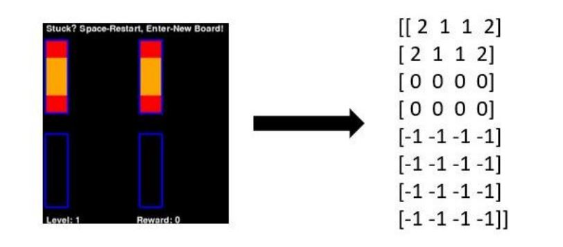
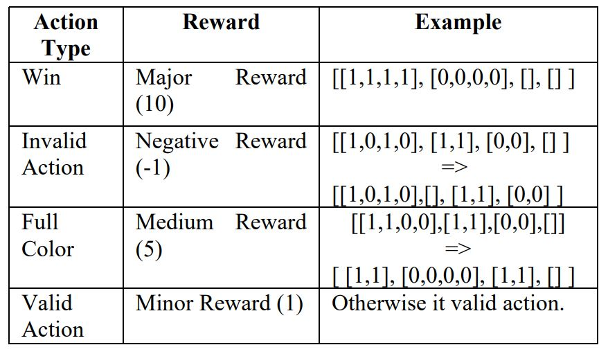

# Water Sort AI

Welcome to the Water Sort Puzzle AI project! This project features an artificial intelligence system that has learned to play the Water Sort Puzzle game. Water Sort Puzzle is a popular mobile puzzle game where the player is tasked with sorting colored water into tubes to complete the level.

## Project Overview

There are 4 different jpynb files. Model and Test files play the game on the screen via pygame. Nodisplay_model and Nodisplay_test play the game through lists. Additionally, the model is trained separately for each level.

## Prerequisites

All you need to run is described in the jpynb file. They are also shared below:

```bash
pip3 install torch torchvision torchaudio --extra-index-url https://download.pytorch.org/whl/cu113
pip install stable-baselines3[extra] protobuf==3.20.*
pip install  pydirectinput gym
```

## Environment

The game gives a list as an output after each action. This output contains all information about the current state of the game. So, it can be used as observation. State representation of game:



Each action consists of two steps. First step: select tube, Second step: select target tube. (0, 1) means select the first tube then flow it to the second tube.

Reward system:



## Model

When it comes to choosing an algorithm suitable for this environment, there are two main algorithms. These are A2C (Advantage Actor-Critic) and PPO (Proximal Policy Optimization). After some evaluations and trials, we found that A2C is more suitable for this task. 

After choosing the required algorithm for the method, we created two different sized neural network models and compared the two. While the first architecture is smaller, the other architecture is more complex. The simple architecture which contains 2 hidden layers with 64 neurons in each layer works better. 

## Test

To test the model, you can use ready-made models or models that you have trained yourself. Regardless of whether the display is on or off, both models will work compatible as they have the same environment. My advice is to complete the training process faster with the environment with the display closed and then observe it with the agent with the display open.